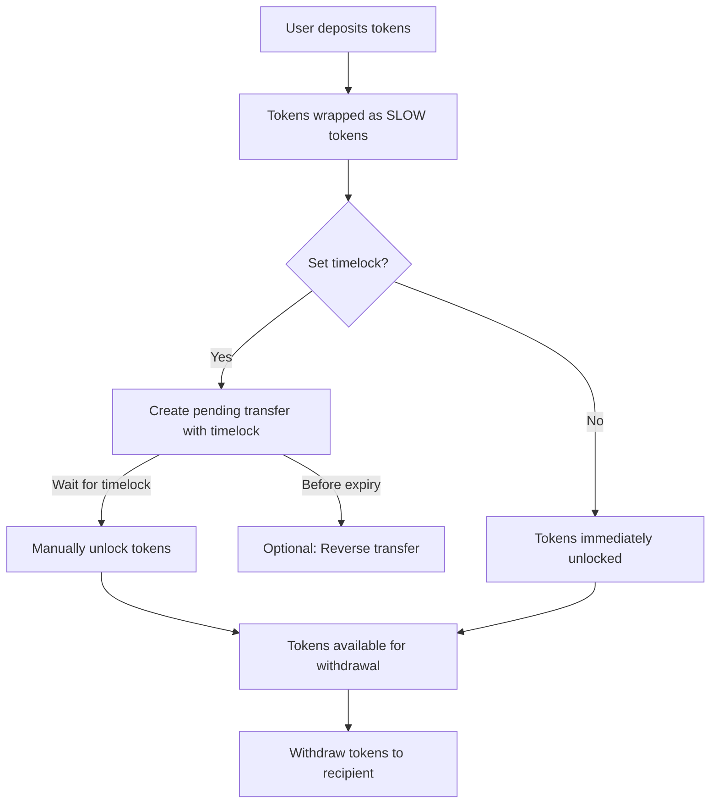
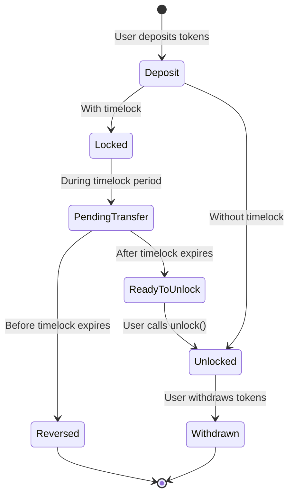

# [SLOW](https://github.com/z0r0z/slow)  [](https://opensource.org/license/agpl-v3/) [](https://docs.soliditylang.org/en/v0.8.28/) [](https://getfoundry.sh/) 

## What is SLOW?

SLOW is a protocol that adds safety mechanisms to token transfers through two powerful features:

1. **Timelock**: Enforces a waiting period before recipients can access transferred tokens
2. **Guardian**: Optional trusted party that can approve or block transfers

Think of it as a security-enhanced way to transfer ETH and ERC20 tokens with built-in protection mechanisms.

## Why Use SLOW?

- **Prevent Theft**: Even if your keys are compromised, attackers must wait for the timelock to expire
- **Reverse Mistakes**: Cancel erroneous transfers before the timelock expires
- **Secure High-Value Transactions**: Add guardian approval for extra security
- **Schedule Transfers**: Set timelock periods from seconds to days or longer

## Key Features

- Wrap and send ETH or any ERC20 token
- Set custom timelock periods for each transfer
- Appoint a guardian to approve sensitive transfers
- Reverse pending transfers before timelock expiry
- Visually track tokens with dynamic SVG renders
- Multicall support for batched operations

## How It Works

### Core Concepts

SLOW uses the ERC1155 token standard to represent wrapped tokens with timelock and guardian protections:


1. **Tokenization**: Each base token (ETH or ERC20) is wrapped into a SLOW token
2. **Token ID Encoding**: The token ID encodes both the token address and timelock period
3. **Balance States**: Token balances exist in two states - locked and unlocked
4. **Transfer Flow**: Transfers go through a predictable lifecycle with safety checks

### Typical User Flow



### Transfer States Visualization



## Practical Examples

### Example 1: Basic Timelock Transfer

Alice wants to send 1 ETH to Bob with a 24-hour timelock:

1. Alice calls `depositTo` with parameters:
   - token: 0x0000000000000000000000000000000000000000 (ETH)
   - to: Bob's address
   - amount: 1 ETH
   - delay: 86400 (seconds in 24 hours)

2. The contract:
   - Creates a unique transferId
   - Records a pending transfer with the current timestamp
   - Mints a SLOW token to Bob representing the locked 1 ETH

3. After 24 hours, Bob calls `unlock(transferId)` to move the tokens to his unlocked balance

4. Bob can now call `withdrawFrom` to get the actual ETH

### Example 2: Guardian Protected Transfer

Charlie sets up a guardian for extra security:

1. Charlie calls `setGuardian(guardianAddress)` to designate a trusted guardian

2. When Charlie wants to transfer tokens, the transfer requires guardian approval

3. Charlie initiates a transfer to Dave with `safeTransferFrom`

4. The guardian calls `approveTransfer(Charlie's address, transferId)` to approve

5. If the transfer had a timelock, Dave still needs to wait and then unlock it

6. Without guardian approval, the transfer remains pending indefinitely

### Example 3: Reversing a Mistaken Transfer

Emma accidentally sends tokens to the wrong address:

1. Emma initiates a transfer with a 48-hour timelock

2. Emma realizes the mistake and calls `reverse(transferId)` before the timelock expires

3. The tokens are returned to Emma's address

## Key Functions

### Core Transfer Functions

- **`depositTo(token, to, amount, delay, data)`** - Deposit tokens and create a timelock
- **`withdrawFrom(from, to, id, amount)`** - Withdraw unlocked tokens
- **`safeTransferFrom(from, to, id, amount, data)`** - Transfer tokens with security checks
- **`unlock(transferId)`** - Unlock tokens after timelock expiry

### Guardian Management

- **`setGuardian(guardian)`** - Designate an address as your guardian
- **`approveTransfer(from, transferId)`** - Guardian approves a pending transfer

### Utility Functions

- **`predictTransferId(from, to, id, amount)`** - Calculate the ID for a pending transfer
- **`reverse(transferId)`** - Cancel a pending transfer before timelock expiry
- **`encodeId(token, delay)`** - Create a token ID from token address and timelock
- **`decodeId(id)`** - Extract token address and timelock from token ID

## Technical Details

### Token ID Structure

Each SLOW token ID encodes two pieces of information:
- Lower 160 bits: The underlying token address (0x0 for ETH)
- Upper 96 bits: The timelock delay in seconds

```
|---- 96 bits ----|---- 160 bits ----|
|     Timelock    |   Token Address  |
```

### Transfer ID Generation

Each transfer gets a unique ID generated from:
```solidity
keccak256(abi.encodePacked(from, to, id, amount, nonces[from]))
```

This ensures each transfer can be uniquely identified and tracked.

## Security Considerations

- **Guardian Cooldown**: 1 day cooldown between guardian changes prevents flash attacks
- **Reversible Transfers**: Only possible before timelock expiry
- **Reentrancy Protection**: External-facing functions protected against reentrancy attacks
- **Balance Tracking**: Strict accounting of locked vs. unlocked balances

## Getting Started

Run: `curl -L https://foundry.paradigm.xyz | bash && source ~/.bashrc && foundryup`

Build the foundry project with `forge build`. Run tests with `forge test`. Measure gas with `forge snapshot`. Format with `forge fmt`.

## GitHub Actions

Contracts will be tested and gas measured on every push and pull request.
You can edit the CI script in [.github/workflows/ci.yml](./.github/workflows/ci.yml).

## Blueprint

```txt
lib
├─ forge-std — https://github.com/foundry-rs/forge-std
src
├─ SLOW — Protocol Contract
test
└─ SLOW.t - Test Protocol Contract
```

## Disclaimer

*These smart contracts and testing suite are being provided as is. No guarantee, representation or warranty is being made, express or implied, as to the safety or correctness of anything provided herein or through related user interfaces. This repository and related code have not been audited and as such there can be no assurance anything will work as intended, and users may experience delays, failures, errors, omissions, loss of transmitted information or loss of funds. The creators are not liable for any of the foregoing. Users should proceed with caution and use at their own risk.*

## License

See [LICENSE](./LICENSE) for more details.
