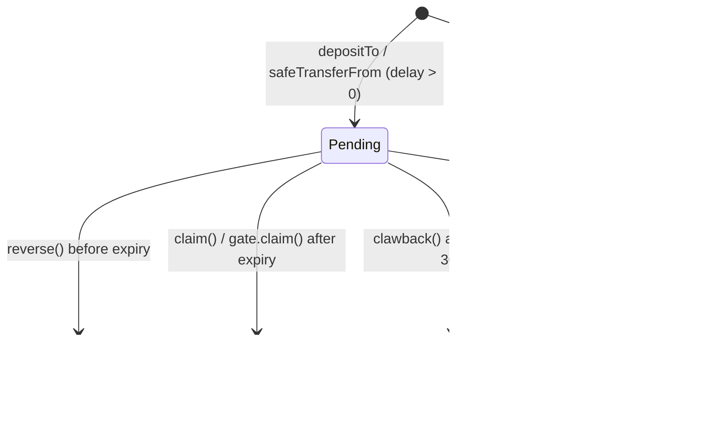
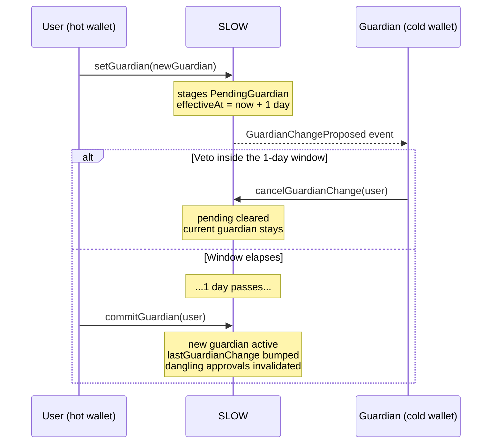
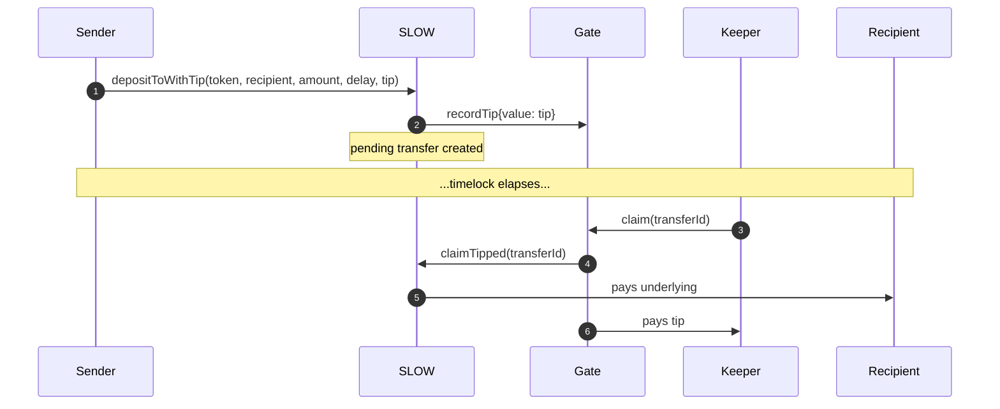

# [SLOW](https://github.com/z0r0z/slow)  [](https://opensource.org/license/agpl-v3/) [](https://docs.soliditylang.org/en/v0.8.34/) [](https://getfoundry.sh/)

## What is SLOW?

SLOW is an ERC-1155 wrapper around ETH and ERC-20 tokens that adds two opt-in safety mechanisms to every transfer:

1. **Timelock** — recipients have to wait before they can extract the underlying.
2. **Guardian** — an optional cosigner who must approve every outflow.

Wrap once, then send, hold, and reverse with safety rails. Any token, any delay, any time.

## Try it

- **Contract:** [`0x000000000000888741B254d37e1b27128AfEAaBC`](https://contractscan.xyz/contract/0x000000000000888741B254d37e1b27128AfEAaBC)
- **Onchain dapp (served by the contract via `html()`):** https://0x000000000000888741b254d37e1b27128afeaabc.w4eth.io/
- **Hosted dapp:** https://slow.wei.is/

The contract embeds its own frontend in two SSTORE2 chunks; `w4eth.io` resolves the on-chain HTML over the web for convenience, but the dapp can be reconstructed by anyone calling `html()` directly.

## Why use SLOW?

- **Reverse mistakes.** Sent to the wrong address? Cancel before the timelock expires.
- **Buy time on a key compromise.** Funds in a pending transfer can't be extracted until the timelock elapses — long enough for an issuer freeze (USDC, USDT) or your own response.
- **Cosign sensitive transfers.** Set a guardian (a cold wallet, a trusted friend) to approve every outflow.
- **Sponsor delivery.** Attach a tip alongside the deposit and let any keeper push the funds — the recipient never needs ETH for gas.
- **Recover dead sends.** A 30-day clawback window catches transfers to lost or never-claimed addresses.

## How it works

### Wrap → wait → settle

Each SLOW token is an ERC-1155 position whose id encodes both the underlying token and a timelock delay. Every account has a wrapper balance and a separate per-id `unlockedBalance`. Outflows draw only from `unlockedBalance`; the timelock is the bridge between the two.

```
| 96 bits  |        160 bits      |
|  delay   |    token address     |     ← token id (delay in seconds, 0x0 for ETH)
```

A `depositTo` mints the wrapper to the recipient but parks the credit in a `pendingTransfer` until the timelock expires. After expiry the recipient (or an operator) settles. Before expiry the sender can reverse. Long after expiry, if no one settled, the sender can clawback.


### Lifecycle


```mermaid
stateDiagram-v2
    [*] --> Pending: depositTo / safeTransferFrom (delay > 0)
    [*] --> Unlocked: depositTo (delay == 0)
    Pending --> Reversed: reverse() before expiry
    Pending --> Unlocked: unlock() after expiry
    Pending --> Settled: claim() / gate.claim() after expiry
    Pending --> Clawed: clawback() after expiry + 30d
    Unlocked --> Withdrawn: withdrawFrom()
    Reversed --> [*]
    Settled --> [*]
    Clawed --> [*]
    Withdrawn --> [*]
```

### Windows

```
            t₀                              expiry              expiry + 30d
   ─────────●─────────────────────────────────●───────────────────●────────────►
                ←────── reverse() ──────→     ←──── unlock() / claim() ───────→
                  sender's recovery window     recipient (or operator) settles
                                                                   ←─ clawback() ─→
                                                                    sender's last resort
```

Reverse and clawback are mutually exclusive: reverse is a pre-expiry primitive, clawback is post-expiry-plus-30-days, and any settlement (`unlock` / `claim`) in between disables both.

## Use cases

### 1. Reversible payments

Send with a delay. Bob sees the wrapper immediately but can only extract the underlying after the timelock. Alice has the full window to `reverse` if she catches an error.

### 2. Hot-wallet hardening

Wrap funds you hold long-term with a delay. A stolen key cannot drain the underlying for the full window — buying time for an issuer freeze (USDC, USDT) or for you to act.

### 3. Self-2FA via guardian

Designate a separate cold wallet as your guardian. Every outflow then requires the cold wallet's `approveTransfer`. Rotating an active guardian stages a 1-day veto window — a stolen key cannot quietly remove the guardian, because the cold wallet sees `GuardianChangeProposed` and calls `cancelGuardianChange`.


```mermaid
sequenceDiagram
    participant User as User (hot wallet)
    participant SLOW
    participant Guardian as Guardian (cold wallet)

    User->>SLOW: setGuardian(newGuardian)
    Note over SLOW: stages PendingGuardian<br/>effectiveAt = now + 1 day
    SLOW-->>Guardian: GuardianChangeProposed event

    alt Veto inside the 1-day window
        Guardian->>SLOW: cancelGuardianChange(user)
        Note over SLOW: pending cleared<br/>current guardian stays
    else Window elapses
        Note over SLOW: ...1 day passes...
        User->>SLOW: commitGuardian(user)
        Note over SLOW: new guardian active<br/>lastGuardianChange bumped<br/>dangling approvals invalidated
    end
```

### 4. Sponsored / gasless delivery

Use `depositToWithTip` to attach an ETH tip alongside the deposit. Any keeper can call `gate.claim(transferId)` after expiry to push the funds; the keeper takes the tip. The recipient never needs gas. If the transfer cleared by a non-gate path (recipient-direct claim, sender reverse, sender clawback), the depositor recovers the tip via `gate.refundTip`.


```mermaid
sequenceDiagram
    autonumber
    participant Sender
    participant SLOW
    participant Gate
    participant Keeper
    participant Recipient

    Sender->>SLOW: depositToWithTip(token, recipient, amount, delay, tip)
    SLOW->>Gate: recordTip{value: tip}
    Note over SLOW: pending transfer created
    Note over Sender,Recipient: ...timelock elapses...
    Keeper->>Gate: claim(transferId)
    Gate->>SLOW: claimTipped(transferId)
    SLOW->>Recipient: pays underlying
    Gate->>Keeper: pays tip
```

### 5. Lost-recipient recovery

If you send to an address that never claims (compromised key, dead wallet), `clawback` returns the funds to you 30 days after expiry — provided the transfer is still pending.

### Holding SLOW long-term: fuse vs. vault

A pure timelock is a **one-shot fuse, not a perpetual lock.** Once `delay` expires on a self-deposited position, anyone with the key can `unlock` then `withdrawFrom` in two txs. To hold SLOW long-term as a vault, pair the delay with a **guardian** — that's the durable second factor. With a guardian set, even a fully compromised hot wallet cannot extract the wrapped underlying.

## Functions

### Deposit

| Function | Purpose |
| --- | --- |
| `depositTo(token, to, amount, delay, data)` | Wrap and create a pending transfer (or unlock immediately if `delay == 0`). |
| `depositToWithTip(token, to, amount, delay, tip, data)` | Same, plus a relayer tip held by the gate. Requires `delay != 0`, `tip != 0`, `tip <= type(uint96).max`. |

### Settle / move

| Function | Purpose |
| --- | --- |
| `unlock(transferId)` | Recipient or operator: park an expired pending into `unlockedBalances[to]`. |
| `claim(transferId)` | Recipient or operator: one-step settle to underlying. Reverts when `to` has a guardian. |
| `withdrawFrom(from, to, id, amount)` | Burn unlocked wrapper and pay underlying. Guardian-gated if `from` has one. |
| `safeTransferFrom(from, to, id, amount, data)` | Move unlocked wrapper. Re-locks if id has a delay; guardian-gated if `from` has one. |
| `reverse(transferId)` | Sender or operator: cancel a pending transfer before expiry. |
| `clawback(transferId)` | Sender or operator: recover a pending transfer 30 days past expiry. |

### Guardian

| Function | Purpose |
| --- | --- |
| `setGuardian(newGuardian)` | First-time set is immediate; rotating an active guardian stages a 1-day veto window. |
| `cancelGuardianChange(user)` | User or active guardian: veto a pending rotation during the window. |
| `commitGuardian(user)` | Permissionless: finalize a rotation after the window. |
| `approveTransfer(from, transferId)` | Guardian only: approve a precomputed transfer or withdrawal id. |
| `revokeApproval(from, transferId)` | Guardian only: retract a single approval. |

### Gate (sponsored delivery)

The gate is a CREATE2-deployed `claim`-only operator. Approve via `setApprovalForAll(slow.gate(), true)` to opt into keeper-driven settlement.

| Function | Purpose |
| --- | --- |
| `gate.claim(transferId)` | Settle one transfer; pay tip if any. Without a tip, requires recipient operator approval on the gate. |
| `gate.claimMany(ids[])` | Atomic batch settle. |
| `gate.refundTip(transferId)` | Depositor recovers the tip after the transfer cleared by a non-gate path. |

### View helpers

| Function | Purpose |
| --- | --- |
| `predictTransferId(from, to, id, amount)` | Hash of the next outbound transfer / transfer-approval preimage. |
| `predictWithdrawalId(from, to, id, amount)` | Hash of the next withdrawal-approval preimage (distinct op-type). |
| `canReverseTransfer(transferId)` | `(canReverse, reason)` preflight. |
| `isGuardianApprovalNeeded(user, to, id, amount)` | Does the next `safeTransferFrom` need cosign? |
| `isWithdrawalApprovalNeeded(user, to, id, amount)` | Does the next `withdrawFrom` need cosign? |
| `getOutboundTransfers(user)` / `getInboundTransfers(user)` | All pending transfer ids. |
| `outboundTransferCount` / `outboundTransferAt` (and inbound equivalents) | Paginated access — preferred for on-chain consumers. |
| `encodeId(token, delay)` / `decodeId(id)` | Token-id helpers. |
| `html()` | Returns the dapp HTML reassembled from on-chain SSTORE2 chunks. |

## Technical details

### Transfer id

```solidity
keccak256(abi.encodePacked(
    from, to, id, amount,
    nonces[from], lastGuardianChange[from], opType
))
```

`opType` is `0` for transfers/deposits and `1` for withdrawals — this prevents a guardian approval for one op being consumed as the other. `lastGuardianChange[from]` is mixed in so a guardian rotation invalidates every dangling approval at once.

### Op-type split

Guardian approvals come in two flavors with distinct preimages:

- **Transfer approval** — for `safeTransferFrom` (use `predictTransferId`).
- **Withdrawal approval** — for `withdrawFrom` (use `predictWithdrawalId`).

Approving one will not satisfy the other. Guardians must still verify intent off-chain.

### Multicall and SVG

- `Multicallable` (Solady) lets clients batch read/write calls; the inherited implementation reverts on nonzero `msg.value`, so payable deposits cannot be smuggled into a batch to drain the pool via `msg.value` reuse.
- Every id has a generated SVG render exposed via `uri(id)` — useful for marketplace and wallet display.

## Security considerations

- **No admin, no upgrades, no fees.** The contract has no owner, no pausable, and no upgrade path. Behavior is fixed at deployment.
- **Guardian veto window.** Rotating an active guardian stages a 1-day delay. Either party can `cancelGuardianChange` during the window; only `commitGuardian` works after. The window is the decision period, not an indefinite veto.
- **Reverse window.** Only before timelock expiry. A reverse from the compromised key credits `unlockedBalances` back to the same compromised account, so `reverse` alone is not a recovery primitive — it relies on the sender's key being safe.
- **Clawback grace.** 30 days post-expiry, and only if the transfer is still pending. Recipient or any operator can `unlock` or `claim` during the grace window to settle and disable clawback.
- **Wallet display vs. spendability.** ERC-1155 wallets and marketplaces see the full wrapper balance, including amounts still in pending transfers. `unlockedBalances[user][id]` is the source of truth for what is actually spendable.
- **Reentrancy.** Transient-storage guard on every external entry point.
- **ERC-1155 deviations.** `safeBatchTransferFrom` is disabled; zero-amount transfers revert. `supportsInterface` still claims ERC-1155 — treat this as ERC-1155-derived rather than fully compliant.
- **Inbound-set spam.** Anyone can deposit dust to your inbound set. On-chain consumers should paginate via `inboundTransferCount` + `inboundTransferAt(i)` rather than calling `getInboundTransfers`.
- **Unsupported tokens.** Fee-on-transfer and rebasing tokens (e.g. stETH) break the wrapper's 1:1 accounting. Wrap rebasing assets to their non-rebasing equivalent (e.g. wstETH) before depositing.
- **Gate cannot redirect funds.** The `claim` path pins payout to `pt.to`; the gate has no path to `safeTransferFrom` or `withdrawFrom`. Keepers can only choose *when* to settle, not *where* funds go.

## Build & test

```sh
curl -L https://foundry.paradigm.xyz | bash && source ~/.bashrc && foundryup
forge build
forge test
```

`forge snapshot` for gas. `forge fmt` to format.

Dapp tests run on vanilla Node — no NPM:

- `node test/slow_html.test.mjs` — unit tests for the dapp's deterministic helpers (keccak256, namehash, ABI codec, parse/formatUnits, id codec, every selector). Crosschecked against `cast keccak` / `cast sig`.
- `node test/slow_html.e2e.test.mjs` — end-to-end. Spawns `anvil`, deploys SLOW, drives the dapp's flow functions against the live contract, asserts on-chain state matches dapp state. Requires `anvil` on PATH and a current `forge build`.

`SLOW.html` is read in memory by both runners — never modified.

## Layout

```txt
SLOW.html       — onchain dapp (served via html())
src/
└─ SLOW.sol     — protocol contract (also defines SLOWGate)
test/
└─ SLOW.t.sol   — full test suite (mainnet fork)
lib/
├─ solady       — https://github.com/vectorized/solady
└─ forge-std    — https://github.com/foundry-rs/forge-std
foundry.toml
```

## Disclaimer

*These smart contracts and testing suite are being provided as is. No guarantee, representation or warranty is being made, express or implied, as to the safety or correctness of anything provided herein or through related user interfaces. This repository and related code have not been audited and as such there can be no assurance anything will work as intended, and users may experience delays, failures, errors, omissions, loss of transmitted information or loss of funds. The creators are not liable for any of the foregoing. Users should proceed with caution and use at their own risk.*

## License

See [LICENSE](./LICENSE) for more details.
